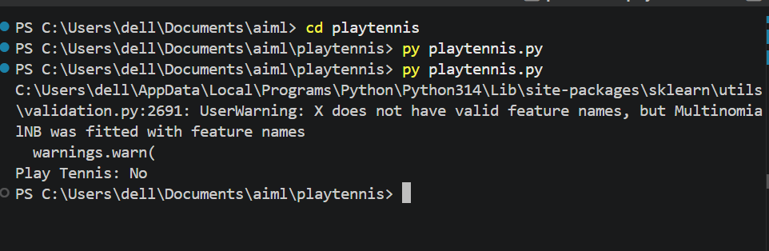

# Multinomial Naive Bayes - Play Tennis Prediction

This project demonstrates the implementation of **Multinomial Naive Bayes** using Scikit-Learn on the **Play Tennis** dataset. The model is trained to predict whether a game of tennis should be played based on weather conditions.

## Dataset

* Play Tennis Dataset
* Features:

  * Outlook
  * Temperature
  * Humidity
  * Wind
* Target:

  * **Yes** → Play Tennis
  * **No** → Do Not Play Tennis
\

## Workflow

1. Create the Play Tennis dataset.
2. Encode categorical values using `LabelEncoder`.
3. Split features and target.
4. Train the Multinomial Naive Bayes model.
5. Predict whether to play tennis for a given weather condition.

## Output

The program predicts whether the given weather conditions are suitable for playing tennis.

**Example Output:**

* **Play Tennis: Yes**
* **Play Tennis: No**

